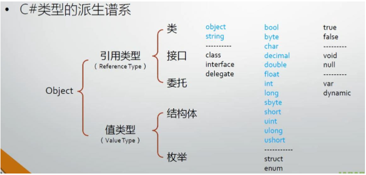
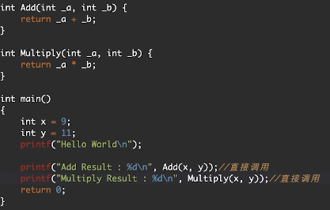
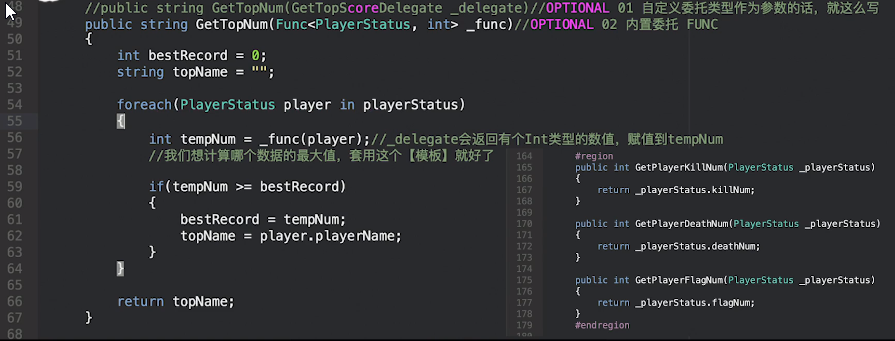
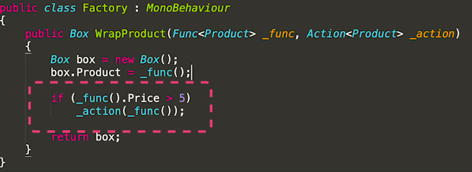
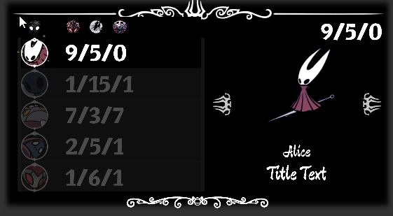
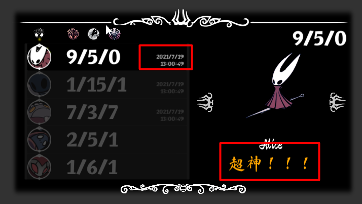

# Delegate-Practise

通过总结利用C#的委托，事件模型，更好的来管理整个代码结构，同时也会运用一个泛型的排序算法做一个由事件委托构建的UI界面。

## 委托



首先要清楚的是，委托是一种**引用类型的数据类型**。

我们可以通过委托类型的变量间接调用方法。


委托的声明既像类，也像方法，这是因为C#中的委托与先前C++中的函数指针的定义类似。



以上是通过函数直接调用完成数值的加法和乘法。


这里定义了一个Calculator的函数指针，该函数指针返回int类型，输入两个int类型变量，取Add，Multiply函数的地址，间接调用完成加法和乘法。


C#的语法支持这种嵌套类型，但考虑到代码的可读性，委托类型还是要与大的方法类平级最好如下所示：


## 自定义委托应用实例（delegate关键字）

```c#
public class NewDelegate : MonoBehaviour
{
    private SpriteRenderer spriteRenderer;

    void Start()
    {
        spriteRenderer = GetComponent<SpriteRenderer>();
    }

    void Update()
    {
        if (Input.GetKeyDown("space")) {
            Teleport();   //直接调用
            ChangeColor();//直接调用
            printDate();//直接调用
       }
    }

	//随机改变位置
    private void Teleport() { 
        Vector2 currentPos = transform.position;
        currentPos.x = Random.Range(-5f, 5f);
        transform.position = currentPos;
    }
	
	//改变颜色
    private void ChangeColor() {
        spriteRenderer.color = new Color(Random.value,Random.value,Random.value);
    }

	//打印当前时间
    private void printDate()
    {
        Debug.Log("The Current Time:"+ System.DateTime.UtcNow );
    }

}
```

以上首先展示了一种直接调用函数方法的例子

```c#
    private delegate void MyDelegate();

    MyDelegate myDelegate;

    private void OnEnable()
    {
        myDelegate = new MyDelegate(Teleport);
        //单播委托，改变颜色的方法覆盖了Teleport的传送方法
        myDelegate = new MyDelegate(ChangeColor);
        //多播委托 但要注意的是，我们往往会引用一个实例的方法，我们一旦有委托引用这个方法的话，就必须保证该实例（对象）存在于内存当中，这其实就造成了内存泄漏
      	myDelegate += ChangeColor;
    }

    void Start()
    {
        spriteRenderer = GetComponent<SpriteRenderer>();
    }

    void Update()
    {
        if (Input.GetKeyDown("space")) {
            myDelegate.Invoke();
       }
    }
```

在实际的使用过程中，要千万注意如下的一种错误，他重置了委托列表


这会导致原本想启用三个函数，最后只调用了Log这一个函数。

**写在最后：**实际的应用中，其实不需要我们写那么多delegate关键字，C#库已经为我们写好了委托的库，**一个是Action，一个是Func。**

**Action委托无返回值，但可以有参数列表**

**Func委托既有返回值，也有参数列表**


#### 总结：使用委托将相同返回值类型的方法进行封装，之后又可以将委托这一类型当做函数的形参传递进函数中，实现代码的动态调用，这是委托最大的意义。


## 委托使用的方法

### 模板方法

有一处是不确定的，其余代码是确定好的，这个不确定的部分，就依靠我们传进来的委托类型的参数所包含的这个方法来填补。



### 回调方法

根据代码逻辑（往往是if else），动态的选择现在是否调用该委托——>一组方法。




## 项目实际应用情况

### 委托的模板应用



我们现在利用委托来完成一个简单的UI界面，首先一个最典型的问题是，我们需要得到击杀数最高，死亡数最高，助攻数最高的玩家，他们的代码是高度重合的，因此我们可以通过模板类的方法引入一个委托来解决。


我们引入Func类型的委托，Func现在是一个参数为PlayerStatus，返回值是int的委托，他会去委托所有包含参数是PlayerStatus返回是int类型的方法。

这里又有一个知识点是我们应用了lambda表达式，lambda表达式对当前委托变量进行类型推导，并通过匿名函数的形式完成了委托，实际的效果和下方显示定义是一样的。


------

### 委托的回调应用

接下来我们要做的是将这些topName对象的玩家给与不同称号，并在这些玩家获得称号时给与一个时间，最终效果如下所示。



文字称号这一块我们只需要通过简单的if语句进行判断并改变UI Text中的文字即可，而时间的获取较为复杂，我们需要创建一个Logger方法，并在**Logger方法中创建一个静态成员Log，静态成员隶属于类，可以直接通过Logger.Log方法进行调用，无需将Logger实例化，但同时需要注意的是，Static将占据静态区的内存，因此要格外注意使用**。

同样这里也用到了委托回调，我们只有在判断该玩家获得了某项Top值时才调用Log函数


------

### 泛型与特化应用

最简单的排序算法我们想通过特化的方式让某个sort方法应用到整个工程项目中


在使用的过程中经过类型推导能得到实际我们想要的PlayerStatus类型，同时我们在实体类PlayerStatus中写入静态方法，类似Logger.Log使得我们对三种Killnum，flagnum，deathnum进行比较并排序


